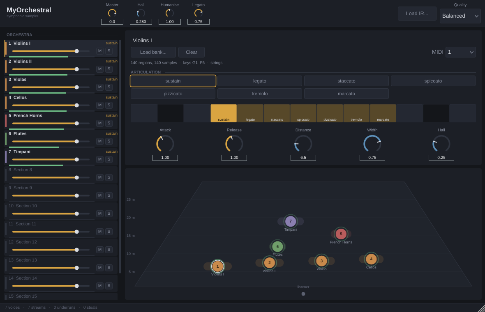

# MyOrchestral

Plugin VST3 / AU d'orchestre symphonique, jouable au clavier MIDI depuis
n'importe quelle DAW. Pensé pour la musique épique et cinématique.

**État : MVP jouable.** Le moteur complet est écrit et testé, le plugin
compile et charge des banques SFZ. Voir [Où en est le projet](#où-en-est-le-projet).



*Capture réelle, produite par `moe_screenshot` : le plugin est instancié, sept
pupitres sont chargés, des notes sont jouées, et l'éditeur est rendu. Ce n'est
pas une maquette.*

---

## À lire en premier

**[docs/00-audit-samples.md](docs/00-audit-samples.md)** — le réalisme d'un
orchestre virtuel vient d'abord des samples, pas du moteur. Ce document dit
honnêtement ce qui est atteignable avec des banques libres, ce qui ne l'est pas,
et quelle décision t'appartient.

Résumé en une phrase : avec des samples libres on obtient une maquette solide,
très correcte en contexte épique dense ; on n'obtient pas un rendu de
bande-annonce indiscernable d'un vrai orchestre, et aucun code ne comble cet
écart.

---

## Démarrage rapide

```bash
# 1. Compiler (macOS, universal binary par défaut)
cmake -B build -G Xcode
cmake --build build --config Release
# le VST3 et l'AU sont copiés automatiquement dans ~/Library/Audio/Plug-Ins/

# 2. Générer une banque jouable, sans rien télécharger
python3 tools/make_placeholder_bank.py --output banks/placeholder-strings

# 3. Vérifier sans DAW
cmake --build build --config Release --target moe_render
./build/tools/Release/moe_render \
    --bank banks/placeholder-strings/placeholder-strings.sfz \
    --out /tmp/test.wav --notes 48,55,60,64 --seconds 3
```

Détails, DAW par DAW : **[docs/02-build-macos.md](docs/02-build-macos.md)**.

### Installeur DMG

```bash
./packaging/make_installer.sh          # -> MyOrchestral-0.1.0.dmg
```

Produit un `.dmg` contenant un installeur qui place l'AU et le VST3 aux bons
endroits. Logic Pro le voit après un redémarrage. Signature et notarisation
seulement si le DMG doit voyager vers une autre machine :
**[docs/05-installeur-macos.md](docs/05-installeur-macos.md)**.

---

## Ce que fait le plugin

**Moteur d'échantillons**
- lecture SFZ, streaming disque avec têtes préchargées en RAM
- couches de vélocité, round-robin par note, keyswitches
- crossfade dynamique au CC1, expression au CC11, pédale de sustain, aftertouch
- legato synthétique : portamento, attaque adoucie, retrait de la note quittée
- micro-variations de hauteur, de timing et de niveau, réglées par famille
- interpolation Hermite 4 points, enveloppes DAHDSR exponentielles
- 256 voix par défaut, vol de voix avec fondu

**Espace**
- réverbe à convolution avec IR personnalisées
- placement sur scène : distance, pré-délai, absorption de l'air, premières
  réflexions, largeur stéréo par pupitre

**Interface**
- mixette 16 pupitres toujours visible
- vue scène : les pupitres sont des points dans une salle, déplaçables
- grille d'articulations et bandeau de keyswitches en temps réel
- thème sombre, diagnostics en bas de fenêtre (voix, streams, dropouts, vols)

**Multi-timbral** — 16 pupitres, un canal MIDI chacun, ou une instance par
pupitre. Les deux modes utilisent le même code.

---

## Structure

```
engine/     le moteur — C++20 pur, zéro JUCE, entièrement testable
plugin/     l'adaptateur JUCE : processeur, paramètres, interface
tests/      54 tests, du parseur SFZ à la chaîne MIDI→audio complète
tools/      générateur de banque placeholder, rendu hors ligne
docs/       audit samples, architecture, build, format de banque, ADR
```

Le moteur ne dépend pas de JUCE, volontairement : il se teste en quelques
secondes sur n'importe quelle machine, et la couche plugin reste remplaçable.
Voir [docs/01-architecture.md](docs/01-architecture.md) et
[docs/adr/](docs/adr/).

---

## Tests

```bash
cmake -B build-tests -DMOE_BUILD_PLUGIN=OFF
cmake --build build-tests
ctest --test-dir build-tests --output-on-failure
```

Aucune dépendance externe : les fixtures audio sont synthétisées à l'exécution.
Environ 15 secondes.

Ce que les tests **ne** couvrent pas, et qui demande une écoute :
le réalisme du legato, le rendu de la réverbe et du placement, la qualité de
l'interpolation en transposition large, le confort de jeu en latence faible.
Ces points sont signalés dans [docs/04-roadmap.md](docs/04-roadmap.md).

---

## Où en est le projet

**Fait**
- moteur complet, testé, sans JUCE
- plugin VST3 / AU / Standalone, interface complète
- chaîne validée de bout en bout : MIDI → keyswitch → sélection → streaming →
  enveloppe → espace → réverbe → sortie
- banque placeholder générée par code, pour jouer immédiatement
- outil de rendu hors ligne

**À faire, par ordre d'utilité**
1. brancher une vraie banque (VSCO 2 CC0) et régler à l'oreille
2. presets et gestionnaire de presets
3. banques cuivres / bois / percussions et patch « orchestre complet »
4. filtres SFZ, format DecentSampler
5. convolution à partitions non uniformes (supprime les 5 ms de latence)

Détail dans [docs/04-roadmap.md](docs/04-roadmap.md).

---

## Licence

Le code de ce dépôt est à toi. **Les banques de samples et les réponses
impulsionnelles ont leurs propres licences** et ne sont pas versionnées ici —
c'est important si le plugin est distribué un jour. Voir
[docs/00-audit-samples.md](docs/00-audit-samples.md) §4.
